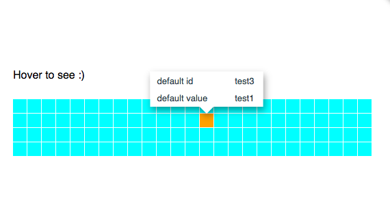

[](https://github.com/vshymanskyy/StandWithUkraine/blob/main/docs/README.md)


# D3 tooltip

## See the [Project Page](https://bumbeishvili.github.io/d3-tooltip/) for interactive example!


## See usage example [at this codepen](https://codepen.io/bumbeishvili/pen/WMvNxM?editors=1010)

## screenshot


### Highlights
* Dynamic resizing
* High number of customization options

### Usage
1. Include `tooltip.js` file into you app

```html
 <script src="tooltip.js"></script>
```
2. Initialize tooltip inside your d3 visual

```javascript
 var tooltip = d3.componentsTooltip()
        .container('.svg-element')
        .content([
          {
            left: "default id",
            right: "{id}"
          },
          {
            left: "default value",
            right: "{value}"
          },
        ])
```

3. Show or hide it on your events
```javascript
   // show tooltip
        tooltip
        .x(100)
        .y(100)
        .show({id:1,value:"some value",name:"some large name"})
```

```javascript
//hide
tooltip.hide()
```


## Author
 [David   B (twitter)](https://twitter.com/dbumbeishvili)  
 [David   B (linkedin)](https://www.linkedin.com/in/bumbeishvili/)  

I am available for freelance data visualization work. Please [contact me](https://davidb.dev/about) in case you'd like me to help you with my experience and expertise

You can also [book data viz related consultation session](https://www.fiverr.com/share/4XxG21) with me
